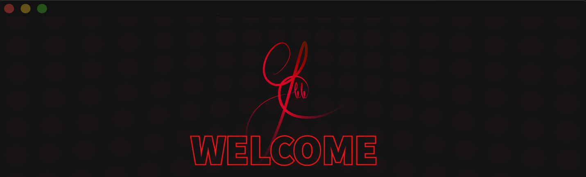

<h1 align="center"> Hi, I'm Joaquim Breno </h2>
</img>

   </img> 
   <em>Computer Engineering at
   <a href="https://www.ufpb.br/">Federal University of Paraiba</a>
   
    Developer and Researcher at 
   <a href="https://aria.ci.ufpb.br/">ARIA</a>
    
    Developer and Researcher at 
   <a href="https://aria.ci.ufpb.br/">ARIA</a>
    
   </em>

  
<h2 align="center"> 🔧 Technologies & Tools </h2>

 
   <a></img></a>
   <a></img></a>
   <a></img></a>
   <a></img></a>
   <a></img></a>
   <a></img></a>
   <a></img></a>
   <a></img></a>
   <a></img></a>
   <a></img></a>
   <a></img></a>
   <a></img></a>
   <a></img></a>
   <a></img></a>
   <a></img></a>
   <a></img></a>
   <a></img></a>
   <a></img></a>
   <a></img></a>
   <a></img></a>
   <a></img></a>
   <a></img></a>
   <a></img></a>
   <a></img></a>

  

  

<!--
**JoaquimBreno/JoaquimBreno** is a ✨ _special_ ✨ repository because its `README.md` (this file) appears on your GitHub profile.

Here are some ideas to get you started:

- 🔭 I’m currently working on ...
- 🌱 I’m currently learning ...
- 👯 I’m looking to collaborate on ...
- 🤔 I’m looking for help with ...
- 💬 Ask me about ...
- 📫 How to reach me: ...
- 😄 Pronouns: ...
- ⚡ Fun fact: ...
-->
